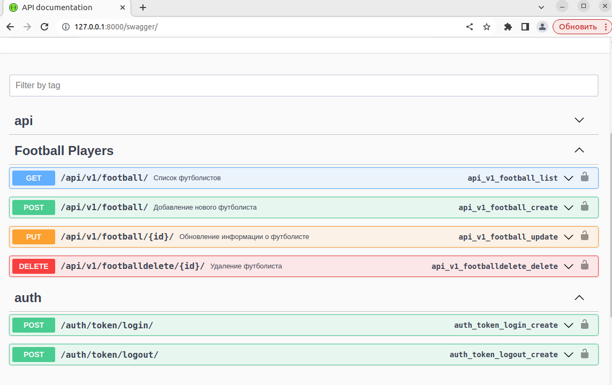

# API Django REST Framework для управления футбольными игроками.

## ОПИСАНИЕ
API предоставляет urls для создания, обновления, получения и удаления записей игроков.

2 модели: футбольные игроки и клубы. 

Использовался python3.10

Через OpenApi реализована документация для проекта (после запуска сервера, доступна по адресу http://127.0.0.1:8000/swagger/):

## ЗАПУСК ПРОЕКТА

1. Склонируйте проект: `git clone https://github.com/Gips22/drf_footballPlayers.git`
2. Установите зависимости: `pip install -r requirements.txt`
3. Запустите сервер: `python manage.py runserver`

